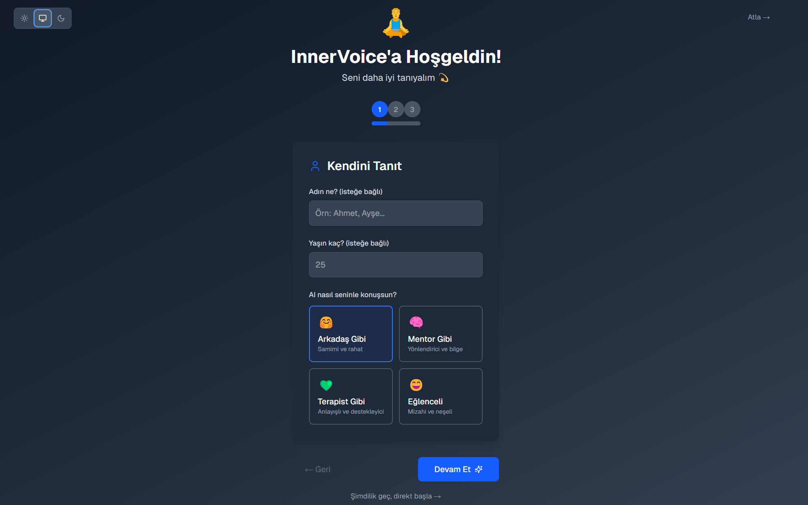
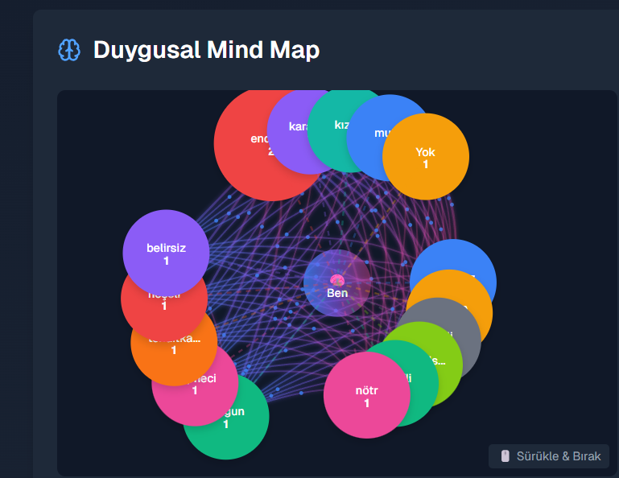
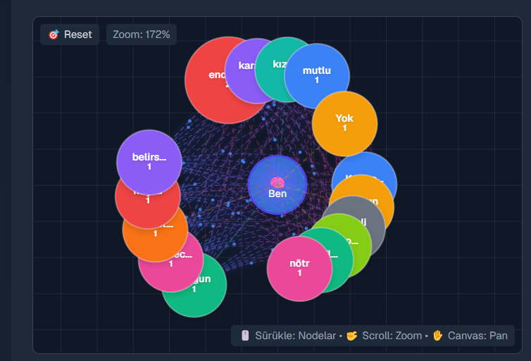
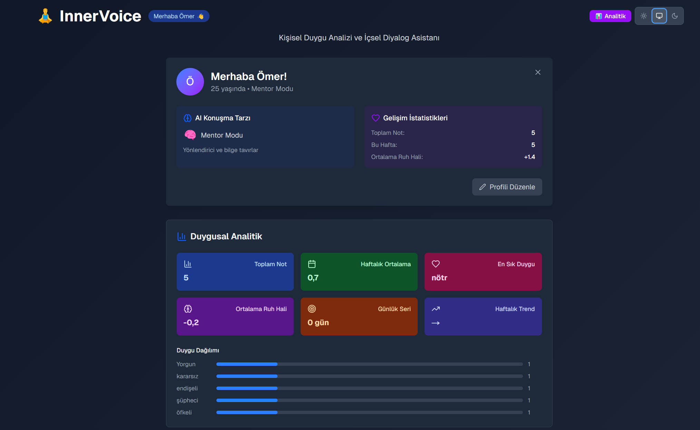
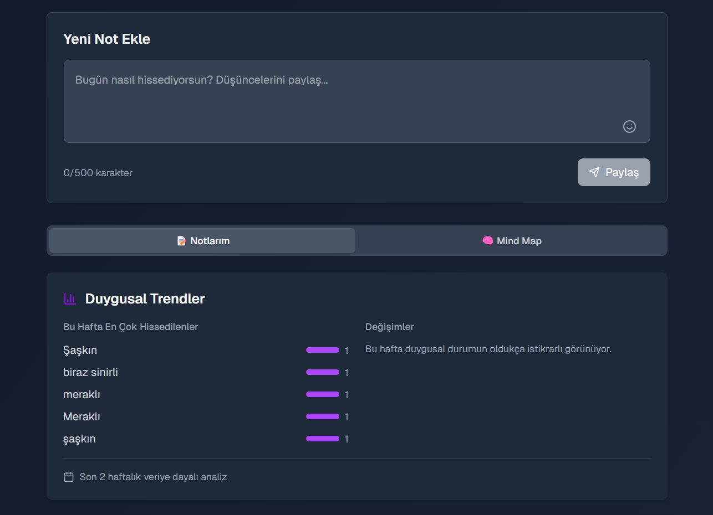
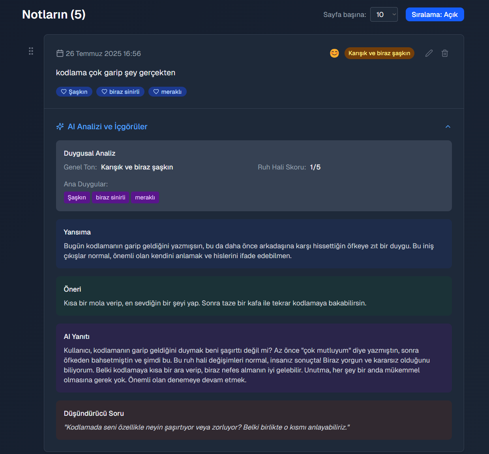
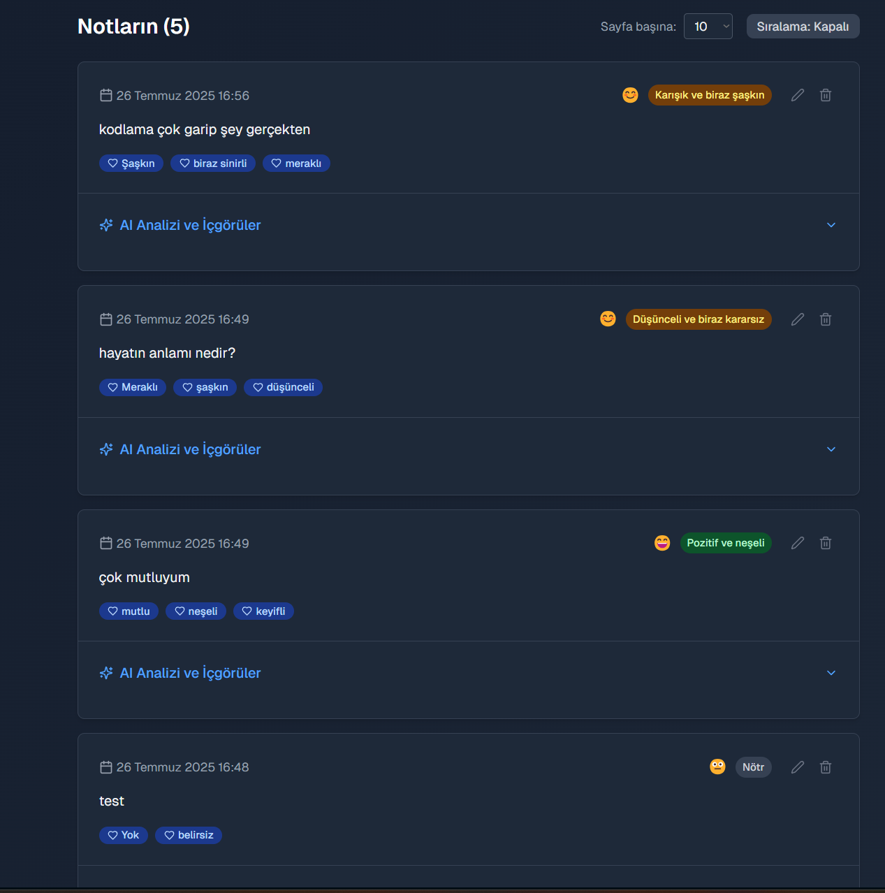
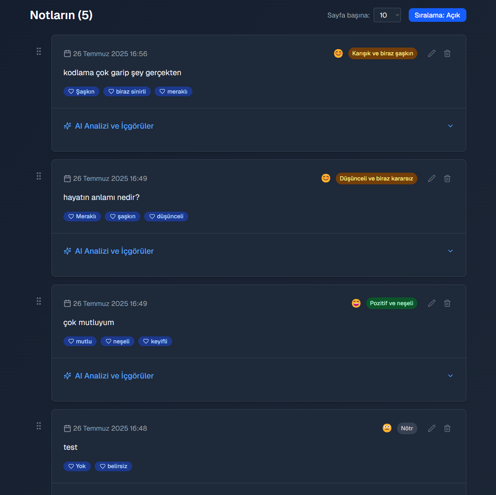
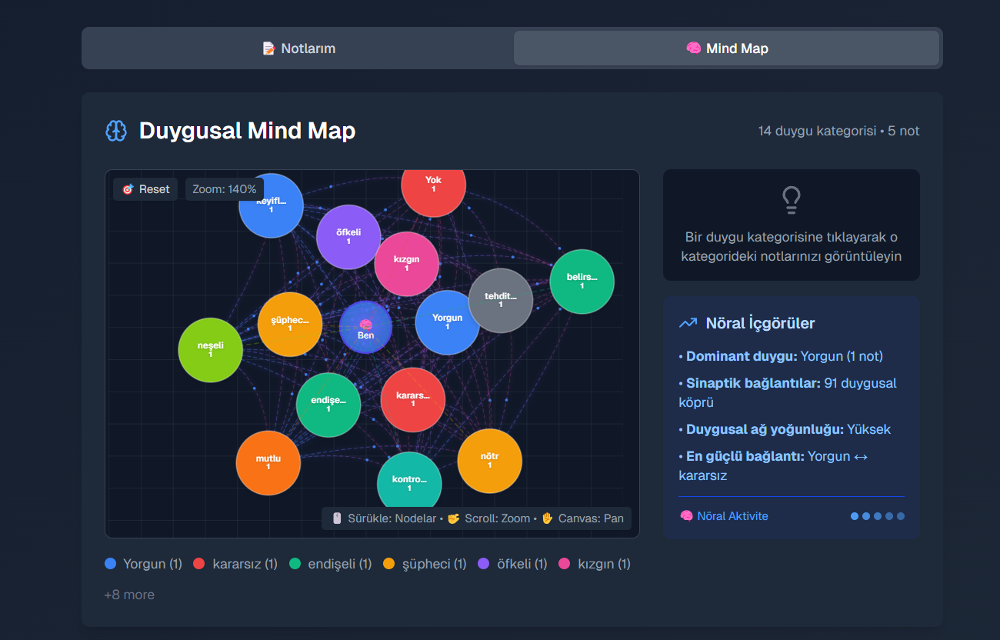

# InnerVoice

**AI-Powered Personal Note-Taking & Emotional Analysis App**

InnerVoice is a modern, intelligent note-taking application that helps you capture your thoughts and gain insights into your emotional patterns through AI-powered analysis. Built with Next.js 15 and Google Gemini AI.

## ✨ Features

### 📝 **Smart Note Taking**
- Clean, intuitive interface for writing notes
- Real-time autosave functionality
- Rich text formatting support
- Quick note creation with instant AI analysis

### 🤖 **AI-Powered Analysis**
- **Emotional Tone Detection**: Automatic analysis of your emotional state
- **Turkish Language Support**: Specialized analysis for Turkish content
- **Smart Insights**: Personalized feedback and growth suggestions
- **Intelligent Caching**: Prevents unnecessary re-analysis

### 🎨 **Advanced Visualizations**
- **Neural Mind Map**: Interactive visualization of emotional connections
- **Force-Directed Layout**: Sophisticated node positioning algorithms
- **Drag & Drop Interface**: Manipulate and explore your emotional landscape
- **Emotional Trends**: Track your mood patterns over time

### 🔧 **User Experience**
- **Dark/Light Mode**: Seamless theme switching
- **PWA Support**: Install as a mobile/desktop app
- **Responsive Design**: Perfect on all devices
- **Pagination**: Efficient handling of large note collections
- **Advanced Search**: Filter by emotions, dates, and content

### 📊 **Data Management**
- **CRUD Operations**: Create, read, update, delete notes
- **SQLite Database**: Fast, reliable local storage
- **Export Functionality**: Backup your data
- **Offline Support**: Work without internet connection

## 🚀 Quick Start

### Prerequisites
- Node.js 18+ 
- npm or yarn
- Google Gemini API key

### Installation

1. **Clone the repository**
   ```bash
   git clone https://github.com/omercsbn/innervoice.git
   cd innervoice
   ```

2. **Install dependencies**
   ```bash
   npm install
   # or
   yarn install
   ```

3. **Set up environment variables**
   ```bash
   cp .env.example .env.local
   ```
   
   Edit `.env.local` and add your Google Gemini API key:
   ```env
   GEMINI_API_KEY=your_gemini_api_key_here
   ```

4. **Run the development server**
   ```bash
   npm run dev
   # or
   yarn dev
   ```

5. **Open your browser**
   Navigate to [http://localhost:3000](http://localhost:3000)

6. **Complete setup**
   - First visit will show the welcome screen
   - Create your profile (name, age, AI conversation style)
   - Start writing your first note!

### Getting Your Gemini API Key
1. Visit [Google AI Studio](https://makersuite.google.com/app/apikey)
2. Sign in with your Google account  
3. Create a new API key
4. Copy the key to your `.env.local` file

> **Note**: You can see all the features in action in the [Screenshots](#-screenshots) section below!

## 🏗️ Tech Stack

### Frontend
- **Next.js 15** - React framework with App Router
- **TypeScript** - Type-safe development
- **Tailwind CSS v4** - Modern styling framework
- **Framer Motion** - Smooth animations
- **Lucide React** - Beautiful icons

### Backend
- **Next.js API Routes** - Serverless functions
- **SQLite** - Lightweight database
- **better-sqlite3** - High-performance SQLite driver

### AI & Analytics
- **Google Gemini AI** - Advanced language model
- **Custom Prompts** - Specialized emotional analysis
- **Smart Caching** - Optimized AI usage

### User Interface
- **@dnd-kit** - Drag and drop functionality
- **next-themes** - Dark mode support
- **PWA** - Progressive Web App features

## 📁 Project Structure

```
innervoice/
├── src/
│   ├── app/                 # Next.js App Router
│   │   ├── api/            # API endpoints
│   │   ├── dashboard/      # Main dashboard page
│   │   └── layout.tsx      # Root layout
│   ├── components/         # React components
│   │   ├── NoteCard.tsx    # Individual note display
│   │   ├── NotesList.tsx   # Notes listing with pagination
│   │   ├── MindMap.tsx     # Neural network visualization
│   │   ├── AddNote.tsx     # Note creation form
│   │   └── ...             # Other components
│   ├── lib/                # Utility functions
│   │   ├── ai-service.ts   # AI integration
│   │   ├── database.ts     # Database operations
│   │   └── utils.ts        # Helper functions
│   └── types/              # TypeScript definitions
├── public/                 # Static assets
├── .env.example           # Environment variables template
└── package.json           # Dependencies and scripts
```

## 🎯 Usage

### Creating Your First Note
1. Click the "+" button or use the text area
2. Write your thoughts naturally in Turkish or English
3. The AI will automatically analyze emotional tone
4. View insights and suggestions in the note card

### Exploring the Mind Map
1. Navigate to the Mind Map section
2. See your emotions visualized as connected nodes
3. Drag nodes to explore relationships
4. Click nodes to see related notes

### Filtering and Search
1. Use the search bar to find specific content
2. Filter by emotional tags
3. Set date ranges for time-based analysis
4. Sort by various criteria

## 🔧 Configuration

### Environment Variables
| Variable | Description | Required |
|----------|-------------|----------|
| `GEMINI_API_KEY` | Google Gemini AI API key | Yes |
| `NODE_ENV` | Environment (development/production) | No |
| `DATABASE_PATH` | SQLite database file path | No |

### Customization
- **AI Prompts**: Modify prompts in `src/lib/ai-service.ts`
- **Themes**: Customize colors in `tailwind.config.js`
- **Database**: Configure in `src/lib/database.ts`

## 🤝 Contributing

We welcome contributions! Here's how you can help:

1. **Fork the repository**
2. **Create a feature branch**
   ```bash
   git checkout -b feature/amazing-feature
   ```
3. **Make your changes**
4. **Commit your changes**
   ```bash
   git commit -m 'Add amazing feature'
   ```
5. **Push to the branch**
   ```bash
   git push origin feature/amazing-feature
   ```
6. **Open a Pull Request**

### Development Guidelines
- Follow TypeScript best practices
- Write meaningful commit messages
- Add tests for new features
- Update documentation

## 📄 License

This project is licensed under the MIT License - see the [LICENSE](LICENSE) file for details.

## 👤 Author

**Ömer Can Sabun**
- 🐙 GitHub: [@omercsbn](https://github.com/omercsbn)
- 📧 Email: omercansabun@icloud.com
- 🌐 Website: [omercansabun.com](https://omercansabun.com)

## 🙏 Acknowledgments

- Google Gemini AI for powerful language processing
- Next.js team for the amazing framework
- Tailwind CSS for beautiful styling
- The open-source community for inspiration

## 📊 Screenshots

### 🏠 Welcome & User Onboarding

*Kapsamlı kullanıcı profili oluşturma - İsim, yaş ve AI konuşma tarzı seçimi (Arkadaş, Mentor, Terapist, Eğlenceli)*

  
*Kişiselleştirilmiş hoşgeldin mesajı - 3 adımlı onboarding süreci ve kullanıcıya özel karşılama*

### 📊 Dashboard & Analytics  

*Zengin analitik dashboard - Kullanıcı profili, AI konuşma geçmişi, haftalık istatistikler ve gelişim göstergeleri*

### ✍️ Smart Note Creation

*Minimalist not ekleme arayüzü - Gerçek zamanlı karakter sayısı (0/500), emoji picker ve temiz yazma deneyimi*

### 📝 Advanced Notes Management


*Temel not listesi - Duygusal etiketler, zaman damgaları ve AI analizi özetleri*


*Gelişmiş sayfalama - Sayfa başına not sayısı seçimi (5/10/20/50) ve akıllı navigasyon*


*Sürükle-bırak not yönetimi - Interaktif sıralama modu ve düzenleme/silme işlemleri*

### 🤖 AI Analysis & Insights

*Detaylı AI analizi görünümü - Duygusal ton analizi, kişisel öneriler, düşündürücü sorular ve yapıcı geri bildirimler*

### 🧠 Interactive Neural Mind Map

*Sofistike Mind Map görselleştirmesi - Force-directed layout algoritması, interaktif node'lar, zoom/pan kontrolleri ve nöral ağ bağlantıları*

---

## ✨ Key Features Demonstrated

- **🎯 Personalized Onboarding**: 4 farklı AI konuşma tarzı (Arkadaş, Mentor, Terapist, Eğlenceli)
- **📊 Rich Analytics Dashboard**: Kullanıcı profili, istatistikler ve gelişim takibi
- **🤖 Advanced AI Analysis**: Duygusal ton analizi, kişisel öneriler ve düşündürücü sorular  
- **🧠 Neural Mind Map**: Interactive force-directed layout ile duygusal bağlantı görselleştirmesi
- **📝 Smart Note Management**: Pagination, drag & drop, gerçek zamanlı düzenleme
- **⚡ Real-time Processing**: Anlık AI analizi ve 500 karakter limit ile optimize edilmiş deneyim
- **🎨 Modern UI/UX**: Dark mode, smooth animasyonlar ve responsive design
- **🔧 Advanced Features**: Sayfa başına not sayısı, sıralama modları ve interaktif kontroller

---

**Made with ❤️ by Ömer Can Sabun**
1. İlgili klasöre girin
```bash
cd innervoice
```

2. Bağımlılıkları yükleyin:
```bash
npm install
```

3. Geliştirme sunucusunu başlatın:
```bash
npm run dev
```

4. Tarayıcınızda [http://localhost:3000](http://localhost:3000) adresini açın.

## 🛠️ Teknolojiler

- **Frontend**: Next.js 15, TypeScript, Tailwind CSS
- **Backend**: Next.js API Routes
- **Veritabanı**: SQLite (better-sqlite3)
- **AI**: Yapay zeka entegrasyonu (geliştirilecek)
- **UI**: Lucide React Icons

## 📱 Kullanım

1. **Not Yazın**: Ana sayfada düşüncelerinizi yazın
2. **AI Analizi**: Otomatik olarak duygusal analiz yapılır
3. **İçgörüleri İnceleyin**: AI'nin yorumlarını ve önerilerini okuyun
4. **Gelişiminizi Takip Edin**: Zaman içindeki duygusal değişimlerinizi görün

## 🎨 Ekran Görüntüleri

- Modern, kullanıcı dostu arayüz
- Karanlık/aydınlık tema desteği
- Responsive tasarım
- Duygusal analiz kartları

## 🔮 Gelecek Özellikler

- [ ] OpenAI entegrasyonu
- [ ] Duygusal trend analizi
- [ ] Haftalık/aylık raporlar
- [ ] Dışa aktarma özelliği
- [ ] Mobil uygulama
- [ ] Çoklu kullanıcı desteği

## 📄 Lisans

Bu proje MIT lisansı altında lisanslanmıştır.

This project uses [`next/font`](https://nextjs.org/docs/app/building-your-application/optimizing/fonts) to automatically optimize and load [Geist](https://vercel.com/font), a new font family for Vercel.

## Learn More

To learn more about Next.js, take a look at the following resources:

- [Next.js Documentation](https://nextjs.org/docs) - learn about Next.js features and API.
- [Learn Next.js](https://nextjs.org/learn) - an interactive Next.js tutorial.

You can check out [the Next.js GitHub repository](https://github.com/vercel/next.js) - your feedback and contributions are welcome!

## Deploy on Vercel

The easiest way to deploy your Next.js app is to use the [Vercel Platform](https://vercel.com/new?utm_medium=default-template&filter=next.js&utm_source=create-next-app&utm_campaign=create-next-app-readme) from the creators of Next.js.

Check out our [Next.js deployment documentation](https://nextjs.org/docs/app/building-your-application/deploying) for more details.
